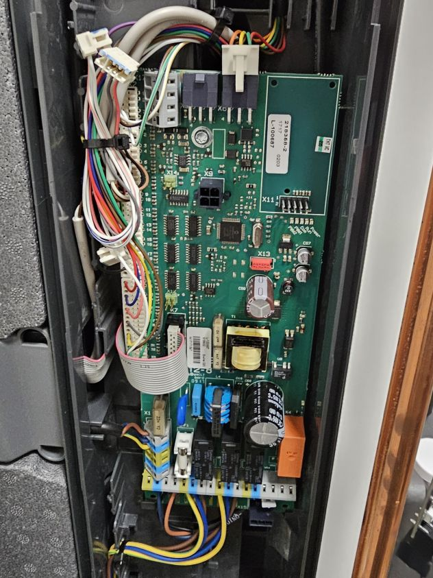
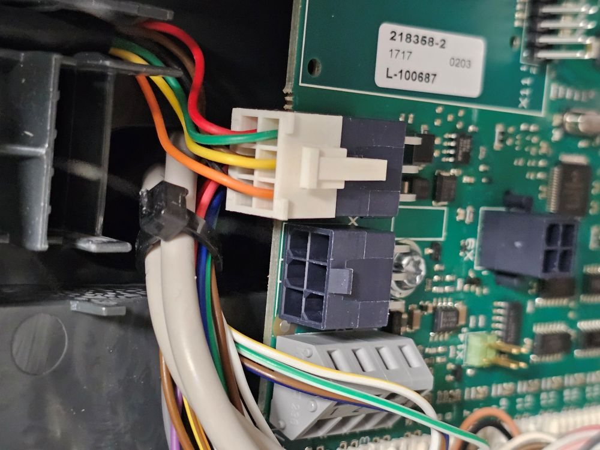
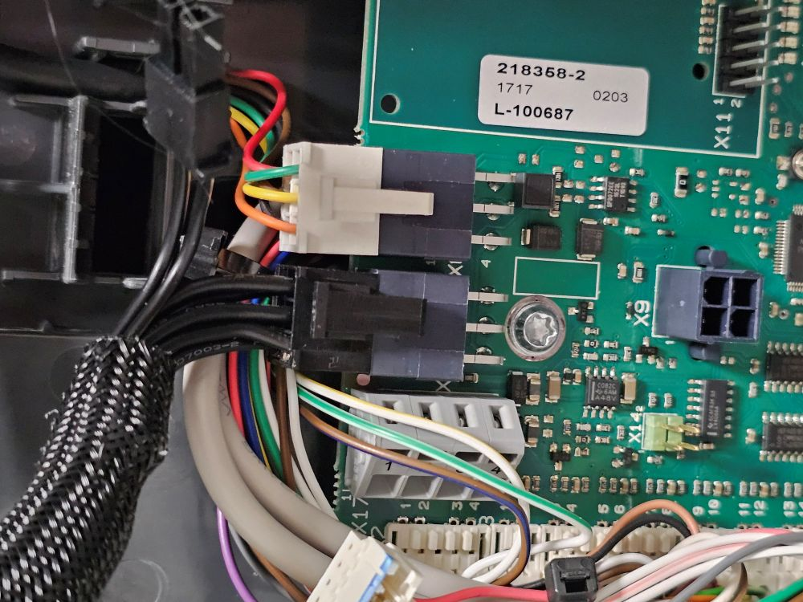

# Nibe Internal Bus for Home Assistant

A local-push custom integration that reads the **internal RS-485 bus** of a Nibe
heat pump — the link the pump's own components use to talk to each other — and
exposes what it carries as Home Assistant entities.

## Why this exists

There are plenty of projects and tools for reading the **external**
Modbus/RS-485 port that many Nibe devices have. I own an **F1226**, which has no
external Modbus/RS-485 port, and which officially has no support at all for
reading sensor data out of the device.

I still wanted its sensor data in Home Assistant. So instead I tapped into the
**internal** RS-485 bus that the heat pump's internal components use to
communicate with each other, decoded it, and built this.

The protocol is broadly similar to what the other Nibe heat pumps expose on
their external interface, but these are **not** processed temperature /
percentage / etc. values — they are **raw ADC and PWM values**, which this
integration converts (see [How the values are
interpreted](#how-the-values-are-interpreted)).

I suspect this could work with other Nibe heat pumps as well. Contributions are
welcome if you are able to test on another Nibe.

## Compatibility

| Model | Status |
| --- | --- |
| F1226 | Tested, all entities verified against the pump's own USB log export |

Nothing else has been tested. If you try another model, please open an issue
with a capture — see [Development](#development).

## ⚠️ Disclaimer

**This worked for me. It might not work for you.** Do your own research. Do not
trust my pinout — there may be different board revisions, different cable
colours, different models. You may break your heat pump if you do not know what
you are doing. There are no warranties of any kind, express or implied.

---

## Hardware installation

The mainboard sits behind the front panel:



It has two similar connectors at the top, labelled **X5** and **X6**. They are
wired identically: one of them goes to the display module, and the other is free
and can be used for this.



| Pin | Signal | Colour on the display cable |
| --- | --- | --- |
| 1 | RS-485 D+ (A) | Black |
| 2 | RS-485 D− (B) | Brown |
| 5 | +12 V | Yellow |
| 6 | GND | Green |

The connector is similar to a PCI-Express GPU 6-pin power connector. I had a
spare cable from a modular PSU, which was a good fit:



I used pins **5 and 6** to power a [LilyGo
T-CAN485](https://github.com/Xinyuan-LilyGO/T-CAN485) board, and connected pins
**1 and 2** to the T-CAN485's RS-485 A/B terminals.

## Software installation

**1. Flash the ESP32.** Install ESPHome on the T-CAN485 with
[`esphome/lilygo-t-can485-passive.yaml`](esphome/lilygo-t-can485-passive.yaml),
which is included in this repository — edited from
[esphome-nibe](https://github.com/elupus/esphome-nibe) for a completely passive
setup. You will need a `secrets.yaml` alongside it with `wifi_ssid`,
`wifi_password`, `api_encryption_key` and `ota_password`, and the ESP32 should
have a static IP.

In this setup `esphome-nibe` must not transmit anything on the bus: the
`acknowledge:` list **must stay empty**, and there are no `constants:` or
`climate:` sections. That is what keeps everything — including this integration
— from ever putting a byte on the RS-485 bus.

**2. Install this integration.** HACS → Custom repositories → add this
repository as an **Integration**, install, restart, then **Settings → Devices &
services → Add integration → Nibe Internal Bus**.

**3. Connect.** Setup asks for the IP and port of your T-CAN485 (the `nibegw`
read port, 9999 by default). It then sends one trigger packet and waits up to 15
seconds for frames from bus address `00F5`; if none arrive, setup fails with a
specific reason rather than creating a device full of unavailable entities.

Once connected it decodes every signal I have been able to decode so far.

> This is not the same thing as the official
> [`nibe_heatpump`](https://www.home-assistant.io/integrations/nibe_heatpump/)
> integration. That one speaks the MODBUS40 accessory protocol over the external
> port. This one is a passive tap on an internal bus that is already there.

## How it stays connected

`nibegw` only forwards captured telegrams to hosts that have sent it a validly
framed request — that is how it learns where to send data. It then forgets a
target 120 seconds after that host's last request
(`NibeGwComponent.h: TARGET_TIMEOUT_MS = 120000`).

So this integration:

1. opens one UDP socket on an OS-assigned local port and **keeps it for the
   lifetime of the config entry** — the device registers the `(ip, port)` tuple,
   so a new source port would create a duplicate target;
2. sends the 4-byte trigger packet `C0 00 00 C0` immediately and then **every
   60 seconds**, i.e. at half the timeout.

That packet is a zero-length slave frame. It is tagged MODBUS40/READ\_TOKEN by
*which port it arrives on*, not by its content, and with `acknowledge:` empty it
is never dequeued onto the RS-485 bus. It is inert.

---

## Entities

### Temperatures

Eleven NTC sensors. The mainboard's own set comes in the `SLAVE 0x90` reply, the
EP14 cooling module's set in `SLAVE 0x91`.

| Entity | Frame / slot | Nibe register |
| --- | --- | --- |
| Outdoor temperature (BT1) | `90` slot 0 | 40004 |
| Hot water top (BT7) | `90` slot 1 | 40013 |
| Hot water bottom (BT6) | `90` slot 2 | 40014 |
| Supply line (BT2) | `90` slot 3 | 40008 |
| Condenser out (BT12) | `91` slot 0 | 40017 |
| Return line (BT3) | `91` slot 1 | 40012 |
| Brine out (BT11) | `91` slot 2 | 40015 |
| Brine in (BT10) | `91` slot 3 | 40016 |
| Hot gas (BT14) | `91` slot 4 | 40018 |
| Suction gas (BT17) | `91` slot 5 | 40022 |
| Liquid line (BT15) | `91` slot 6 | *not exported* |

These have been compared against the pump's own USB log export and agree with it
to within the ADC quantisation floor. They are not approximations.

### Pumps

| Entity | Source |
| --- | --- |
| Heating pump speed (GP1) | `MASTER 0xA0` byte 0 |
| Brine pump speed (GP2) | `MASTER 0xA0` byte 1 |
| GP1 raw duty byte | `MASTER 0xA0` byte 0, undecoded — diagnostic, disabled by default |

### States

| Entity | Source |
| --- | --- |
| Compressor | `MASTER 0x55` byte 0 bit 0 |
| Heating circulation pump | `MASTER 0x55` byte 0 bit 1 |
| Brine pump | `MASTER 0x55` byte 0 bit 2 |
| Three-way valve | `MASTER 0x55` byte 0 bit 3 |
| Operating mode | which command the master polls, `0x96` or `0x99` |
| Relay bitmask (PCA-Base) | `MASTER 0x55` byte 0 — diagnostic, disabled by default |
| Last bus frame | timestamp of the last datagram — diagnostic |

---

## How the values are interpreted

### Temperatures are raw 10-bit ADC counts, not scaled numbers

This is the single thing that matters, and it is what makes every naive attempt
at reading this bus fail.

Each two-byte slot in the `0x90`/`0x91` replies is a **little-endian unsigned
10-bit thermistor ADC count**. The pump samples each sensor as a resistive
divider, so the count is proportional to the thermistor's *resistance*, not to
temperature. Temperature is a logarithmic function of it:

```
adc / 1023 = R / (R + R_fixed)
x          = ln(adc / (1023 - adc))        # = ln(R / R_fixed)
1/T[K]     = c0 + c1·x + c2·x² + c3·x³     # Steinhart-Hart style
°C         = 1/T[K] − 273.15

c = [0.003162333411, 0.000251402068, 1.485144801e-06, 1.11796736e-07]
```

Rough shape of the curve:

| adc | 20 | 120 | 250 | 400 | 550 | 700 | 850 | 950 | 1000 | 1023 |
| --- | --- | --- | --- | --- | --- | --- | --- | --- | --- | --- |
| °C | 182.6 | 102.8 | 74.0 | 54.6 | 39.3 | 24.7 | 7.2 | −11.3 | −31.5 | open |

The coefficients are physics, not curve-fitting: fitting each slot independently
against *different* reference registers yields Beta = 3998, 3984, 3991, 4004,
3908, 3920 K with T(x=0) = 43.09, 43.06, 43.00, 42.95, 43.32, 43.21 °C. Beta
≈ 3980 K is an ordinary NTC specification.

### Out-of-band raw values

| Raw | Meaning | What this integration does |
| --- | --- | --- |
| `1023` (`0x03FF`) | Full scale = **open circuit**, sensor not fitted or disconnected | entity goes `unavailable` |
| `1` | A digital flag sharing the slot layout, not a temperature | ignored |
| `0` | Short circuit | ignored |

`1023` is where the bogus **102.3** came from in earlier `s16/10` decodings. It
is not a sentinel constant the pump chose; it is the literal reading of an open
input. Slots 4–7 of the `0x90` reply and slot 7 of `0x91` are in this category.

### Pump speeds are inverted PWM duty

Both bytes of the `MASTER 0xA0` payload are **duty commands, inverted** — a
bigger byte means a *slower* pump. This is the normal Grundfos/Wilo "profile A"
convention.

```
GP2 % = 100 − byte1
GP1 % = (800 − 10·byte0) / 7   # unverified
```

GP2 is exact. **GP1's scale is unverified** — it is a fit to the only two speeds
the pump has been observed using, and any straight line fits two points. The raw
byte is therefore also available as the disabled-by-default **GP1 raw duty byte**
diagnostic entity, so a future recalibration can be done from recorder history.

### Relay bits

`MASTER 0x55` byte 0, LSB first:

| Bit | Meaning |
| --- | --- |
| 0 | Compressor |
| 1 | Heating circuit pump |
| 2 | Brine (collector) pump |
| 3 | Three-way valve — 0 = heating, 1 = hot water |

Observed values are `2` (idle: circulation only) and `15` (hot water: everything
on, valve diverted).

### Operating mode is in the command byte, not in a payload

`Prio` is **not transmitted as a value anywhere on this bus.** It is encoded
structurally, in three redundant places at once:

| Encoding | Prio 10 (heating/idle) | Prio 20 (hot water) |
| --- | --- | --- |
| which command the master polls | `0x96` | `0x99` |
| that command's one-byte reply | `05` | `06` |
| `0x55` byte 1 | `4` | `12` |
| `0x55` byte 0 bit 3 (valve) | `0` | `1` |

This integration reads the first of these. The `0x96`/`0x99` split partitions
all 16126 captured seconds cleanly, 8690 / 7228. Prio 30 (active heating demand)
was never observed, so an unrecognised poll leaves the mode unchanged rather
than being forced into one of the two known states.

### Confidence

Two values are marked **candidate** rather than confirmed, and are enabled
anyway:

- **GP1 speed** — scale is unverified (see above).
- **Liquid line (BT15)** — `0x91` slot 6 behaves exactly like a real sensor, and
  BT15 is the one EP14 sensor missing from the list, but it is absent from the
  pump's USB log export so it can never be checked against ground truth.

### Update rate and availability

The bus cycles about once per second, which is far too fast to write into the
recorder. Temperatures and pump speeds are published on a timer (15 s by
default, 5–60 s in the integration's options). Relay bits, the valve and the
operating mode are published **the instant they change**, so compressor starts
are not delayed.

An entity becomes `unavailable` when the frame carrying it has not been seen for
60 seconds, or when its sensor reads open-circuit. Registration is maintained
independently of this, so recovery after a network blip needs no restart.

---

## Not decoded

Still unidentified on this bus, and deliberately left out:

- **`cmd 0x92`** — only slots 0 and 3 are populated and both are frozen
  (raw 178 ≈ 58 °C, raw 515 ≈ 42.7 °C); the rest read open. Probably setpoints.
- **`cmd 0x93`** — raw ~915–936 and ~11–16; the second is far outside any
  sensible NTC range, so these are probably not thermistors at all.
- **`cmd 0x85`, `cmd 0xEF`** — `0xEF` replies `0x0E` about every 40 s.
- **Address `00FC` cmd `0x55`** — payload is a constant `0xFF`, in bursts of
  three every ~5 s.
- **`0x55` byte 1 bit 2** — set in both known states.

## Where the decoding rules live

[`custom_components/nibe_internal_bus/fields.py`](custom_components/nibe_internal_bus/fields.py)
says where each value sits on the bus. Entity metadata — translation keys,
device classes, units — lives in `sensor.py` and `binary_sensor.py` and is joined
to those rules by a field identifier derived from each rule's position on the
bus, for example `00F5_SLAVE_91_ntc4`.

## Development

```
pip install -r requirements_test.txt
pytest
```

## License

MIT.

[`esphome/lilygo-t-can485-passive.yaml`](esphome/lilygo-t-can485-passive.yaml)
is adapted from [esphome-nibe](https://github.com/elupus/esphome-nibe), MIT,
Copyright (c) 2022 Joakim Plate.
